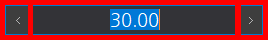
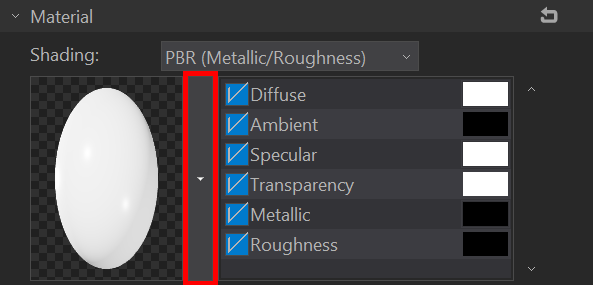

# Tornado3 기초 사용 설명서

## 알림

- 본 제품 사용 설명서에서는 새롭게 추가되거나 개선된 부분에 관해서만 설명합니다.
- 언급되지 않는 기능들은 Tornado2의 그것과 사용 방법 및 결과가 동일합니다.
- 사용된 이미지는 모두 영어를 기준으로 합니다. 이미지의 강조는 빨간색을 사용했습니다.
- 괄호 안에는 추가적인 개발팀의 전달사항이 적혀 있습니다.
- 궁금한 사항 또는 잘못된 사항은 개발팀에 알려주시기 바랍니다.

## 기본 사용자 인터페이스

### 목적 기반 UX/UI

제품은 크게 장면 편집, 송출, NLE 세 가지 목적을 이룰 수 있도록 각 목적에 맞는 최적화된 UI를 제공합니다.

### 목적 선택 도구 바

우측 상단에 목적을 선택할 수 있는 목적 선택 도구 바가 있습니다. 최초 실행 시 장면 편집이 기본으로 선택되어 있으며 필요에 따라 송출, NLE를 선택하여 사용할 수 있습니다. (현재 NLE는 개발 중이라 기능이 제한되어 있습니다.)

### 레이아웃 시스템

Tornado3는 바(bar)를 편의에 따라 자유롭게 배치하고 그 크기를 지정할 수 있어 자신에게 가장 적합한 레이아웃을 만들 수 있습니다. 레이아웃은 목적별로 그 상태가 유지됩니다.

#### 도킹

바를 선택하여 메인 편집 화면 주변으로 도킹시킬 수 있습니다. 또한, 이미 도킹 된 바 주변으로 도킹을 할 수 있습니다. 기본적으로 도킹은 드래그 앤드 드롭 방식으로 동작하며 움직이고자 하는 바를 드래그하여 원하는 위치에 드롭시키면 됩니다. 드래그 중 도킹이 가능하다면 해당 영역이 반투명 회색으로 표시됩니다.

##### 탭 도킹

여러 개의 바를 한 곳에 탭으로 도킹시킬 수 있습니다. 또한, 탭으로 도킹 된 바들은 한 번에 다른 위치로 도킹 시키거나 플로팅 시킬 수 있습니다.

##### 접기/펼치기

메인 편집 화면이 중심이 되어 주변에 도킹 된 방향으로 바를 접고 펼칠 수 있는 접기/펼치기 버튼이 활성화됩니다.

##### 플로팅과 최대화

- 플로팅: 바를 특별히 도킹시키지 않고 원하는 임의의 위치에 뛰어놓을 수 있습니다.
- 최대화: 플로팅 상태에서 제목 표시 줄을 더블 클릭하여 창을 최대화하거나 해제시킬 수 있습니다.

##### 바 닫기

바의 오른쪽에 상단에 위치한 X 모양의 닫기 버튼을 눌러 바를 닫을 수 있습니다.

##### 바 크기 조절

도킹 된 상태의 바 또는 플로팅 된 바의 테두리에서 마우스 왼쪽 버튼을 드래그하여 원하는 크기로 조절할 수 있습니다.

##### 예외 항목

- 상단의 프로젝트 도구 바, 레이아웃 도구 바, 목적 선택 도구 바 그리고 하단의 상태 바는 위치가 고정되어 있습니다.
- 도구 바는 접기/펼치기를 지원하지 않습니다.

#### 창 배치 초기화

메뉴 > 창 > 창 배치 초기화 기능을 사용하여 레이아웃을 프로그램 초기 상태로 되돌릴 수 있습니다.

#### 레이아웃 변경 예제

예를 들어 객체 트리 패널을 떼어 작업 창 오른쪽에 도킹하고자 한다면 다음과 같이 합니다.

##### 기본 도킹

1. 바 선택 및 분리: 아래 그림과 같이 객체 트리 바의 제목 표시줄을 드래그하여 메인 편집 화면 쪽으로 이동시키면 객체 트리 바가 메인 프레임에서 분리됩니다.

1. 도킹 영역 확인: 드래그 상태를 계속 유지하면서 메인 편집 화면 주변에 빨간색으로 표시된 부분 중 오른쪽 빨간색 영역으로 이동시킵니다. 이때 해당 영역으로 도킹할 수 있다면 아래 그림과 같이 그 부분이 회색으로 표시됩니다.

1. 도킹: 도킹 영역이 회색으로 표시되었을 때 드롭 시키면 바가 해당 영역에 도킹 됩니다.

##### 그룹 도킹

이제 객체 트리 바를 원래 있던 위치, 즉 작업 내역 바 탭의 왼쪽으로 다시 되돌려 보겠습니다.

1. 탭 도킹: 아래 그림과 같이 객체 트리 바의 제목 표시 줄을 드래그하여 작업 내역 바가 있는 위치로 이동 시켜 봅니다. 이때 탭으로 도킹이 가능한 영역에 들어서면 도킹 영역이 탭 모양으로 표시됩니다. 이때 드롭 시키면 바가 탭으로 도킹 됩니다.

1. 그룹으로 묶어 분리: 탭으로 도킹 된 바들은 한 번에 묶어 다른 곳에 도킹시킬 수 있습니다. 예를 들어 아래 그림과 같이 탭 좌측의 도킹 바를 드래그하여 패널 탭 전체를 떼어낼 수 있습니다.

1. 그룹 도킹: 메인 편집 화면의 오른쪽에 도킹시키면 아래와 같이 패널 탭 전체가 도킹 됩니다.

#### 접기 / 펼치기

1. 접기/펼치기 버튼: 아래 그림과 같이 도킹 된 패널들의 중앙에는 접기/펼치기 버튼이 표시되며 그 안에 접는 방향이 표시됩니다.

1. 접기/펼치기: 예를 들어 오른쪽 삼각형 모양의 버튼을 클릭하면 아래 그림과 같이 바가 오른쪽으로 접히고 버튼 내의 화살표 방향이 이전과는 반대로 표시됩니다. 이때 다시 버튼을 누르면 바가 원래 있던 위치로 펼쳐지게 됩니다.

#### 플로팅

1. 플로팅: 아래 그림과 같이 패널들은 메인 프레임에서 분리하여 도킹하지 않고 화면 위에 올려둘 수 있습니다.

1. 플로팅 전체화면: 플로팅된 바는 제목 표시 줄을 더블 클릭하여 최대화 시킬 수 있습니다. 예를 들어 듀얼 모니터를 사용한다고 하면 패널들을 편의에 따라 플로팅해 놓거나 전체화면으로 크게 배치하여 활용할 수 있습니다.

#### 반응형 레이아웃 시스템

바의 크기 변경에 반응하여 내부 컨트롤러들은 지정된 레이아웃에 비례하여 그 크기, 위치 등이 새롭게 계산됩니다. 크게 속성 바, 옵션창에서 확인할 수 있습니다.

(이 부분은 개선 사항으로 일반 사용자 설명서에는 포함되지 않아도 됩니다.)

### DPI 지원

고해상도 모니터를 지원합니다. 멀티 모니터를 사용하는 경우에도 프로그램은 모니터의 DPI에 따라 유동적으로 변화합니다.

(서로 다른 모니터 사이를 프로그램이 이동하여도 레이아웃이 유지됩니다.)

### 아이콘 교체

(프로그램에 사용되는 모든 아이콘 이미지들이 교체되었습니다.)

### 마우스 반응형

다음의 컨트롤러들은 마우스 호버링에 반응합니다.

- 버튼
- 텍스트 상자
- 슬라이더
- 리스트
- 콤보 상자
- 스크롤 바
- 슬라이드 에디트

## 새로운 UI 컨트롤러

### 슬라이드 에디트

슬라이드 에디트는 제한된 범위 내의 수치값을 편리하게 조절하기 위해 새롭게 추가된 컨트롤러입니다. 슬라이더 에디터는 아래 그림과 같이 왼쪽 버튼, 수치 슬라이드 및 표시 부분, 오른쪽 버튼으로 구성됩니다.

#### 수치 조절하기

- 슬라이드로 조절하기
  - 수치 슬라이드가 표시되고 있는 상태에서 슬라이드를 좌, 우로 드래그하여 수치를 조절할 수 있습니다.
  - 수치 슬라이드 영역 어디서든 드래그를 시작할 수 있습니다.
- 수치를 입력하여 조절하기
  - 컨트롤러가 포커스 되었을 때 또는, F2 키를 눌러 수치 입력 모드로 진입할 수 있습니다.
  - 
  - 수치 입력 모드에서는 키보드를 통해 바로 수치를 입력할 수 있습니다.
  - ESC 키를 눌러 수치 입력 모드를 해제할 수 있습니다.
- 휠로 조절하기
  - 마우스 휠을 스크롤 하여 수치를 조절할 수 있습니다.
  - 위로 스크롤 할 경우 수치를 높이고, 아래로 스크롤 할 경우 수치를 낮출 수 있습니다.
- 방향키로 조절하기
  - 위 방향키로 수치를 높이고, 아래 방향키로 수치를 낮출 수 있습니다.
  - 추가로 슬라이드 표시 모드에서는 오른쪽 방향키로 수치를 높이고, 왼쪽 방향키로 수치를 낮출 수 있습니다.
  - 수치 입력 모드에서는 오른쪽, 왼쪽 방향키는 수치 사이를 이동하는 데 사용됩니다.
- 방향 버튼으로 조절하기
  - 왼쪽 버튼: 수치를 낮춥니다.
  - 오른쪽 버튼: 수치를 높입니다.
- 미세 조절하기
  - Ctrl 버튼을 누른 상태에서 슬라이드, 휠, 방향키 또는 방향 버튼으로 수치를 조절하게 되면 0.1 단위로 수치를 조절할 수 있습니다.

### 애니메이션 키 지정/해제 버튼

애니메이션이 가능한 속성에는 다이아몬드 모양의 애니메이션 키 지정/해제 버튼이 있습니다. 타임라인에서 프레임 위치를 지정한 뒤 속성값을 변경하고 애니메이션 키 지정 버튼을 누르면 해당 위치에 키가 추가됩니다. 키가 지정되지 않았을 땐 속이 비어 있고, 키가 지정되면 속이 흰색으로 채워져 있습니다. 속이 흰색으로 채워졌을 때 해당 버튼을 누르면 키가 삭제됩니다.

## 스마트 라이브러리 팝업창

라이브러리에 등록된 객체, 스타일, 재질, 효과 등을 필요할 때 팝업 시켜 바로 적용할 수 있습니다. 스마트 라이브러리 팝업창은 가장 상단에 라이브러리의 카테고리가 표시되며 그 아래 라이브러리 내용이 리스트로 표시됩니다. 그리고 가장 하단에 라이브러리를 적용 옵션이 표시됩니다.

1. 카테고리: 카테고리화되어 있는 라이브러리 중 원하는 카테고리를 선택하여 라이브러리를 필터링 할 수 있습니다.
2. 아이템 목록: 선택된 카테고리에 해당하는 아이템들이 표시됩니다. 효과 아이템의 경우 호버링 시 효과를 미리 볼 수 있습니다.
3. 적용 속성: 라이브러리 바에서 Ctrl 버튼을 누른 상태에서 아이템을 적용할 때 팝업되는 적용 옵션과 동일한 옵션이 제공됩니다.

### 동작 방식

- 미리 보기
  - 아이템 목록 위로 마우스를 호버링하면 메인 편집 화면에 객체가 바로 추가되거나, 선택된 객체의 속성이 바로 변경됩니다.
- 적용
  - 라이브러리 목록에서 적용하고자 하는 아이템을 클릭으로 선택하면 실제 객체가 추가되거나, 속성 변경이 완료됩니다.
- 취소
  - 라이브러리 팝업창 외부를 클릭하거나, Esc 버튼을 누르면 작업이 취소됩니다.

### 객체 추가

스마트 라이브러리로 삽입이 가능한 객체는 라이브러리에 등록된 일반 객체, 파티클 시스템, 차트가 있습니다. 각각의 객체는 종류에 따라 다음의 도구 바에 확장 버튼으로 표시됩니다.

-  일반 객체: 생성 바 > 링크 도구의 확장 버튼
-  파티클 시스템: 특수 객체 생성 바 > 파티클 시스템 도구의 확장 버튼
-  차트: 특수 객체 생성 바 > 차트 도구의 확장 버튼

예를 들어 라이브러리에 등록된 파티클 시스템을 바로 메인 편집 화면에 추가하고자 한다면 다음과 같이 특수 객체 생성 바의 파티클 시스템 버튼의 확장 부분을 클릭합니다.

### 스마트 라이브러리로 객체 속성 변경

라이브러리에 등록된 베벨, 스타일, 재질, 효과는 속성 바에서 쉽게 선택하여 바로 적용할 수 있습니다. 다음과 같은 부분에서 스마트 라이브러리 버튼을 제공합니다.

#### 베벨

2D 객체가 선택되어 있을 때 속성 바 > 3D 변환 > 3D 객체 속성 > 깊이 늘리기가 선택되어 베벨 미리 보기 오른쪽에 위치합니다.

#### 모습 > 스타일

2D 객체가 선택되어 있을 때 속성 바 > 모습 > 스타일 패널의 스타일 미리 보기 창 오른쪽에 위치합니다.

#### 모습 > 재질

3D 객체가 선택되어 있을 때 속성 바 > 모습 > 재질 패널의 재질 미리 보기 창 오른쪽에 위치합니다.

#### 효과

객체가 선택되어 있을 때 속성 바 > 효과 > 텍스쳐 효과의 형식 선택 콤보박스 오른쪽에 위치합니다. 또는, 장면이 선택되어 있을 때 속성 바 > 효과 > 체인지 효과의 형식 선택 콤보박스 오른쪽에 위치합니다.

### 스마트 라이브러리 팝업창 사용 예제

1. 2D 객체의 모습 속성 변경: 예를 들어 네모 객체를 선택한 뒤 네모 객체의 모습 속성을 선택하면 아래 그림과 같이 스타일 패널의 스타일 미리 보기 창 오른쪽에 스마트 라이브러리 팝업 버튼이 위치합니다.

1. 팝업 및 적용: 스마트 라이브러리 팝업 버튼을 누르면 아래와 같이 스마트 라이브러리 팝업창이 팝업됩니다. 이때 라이브러리 아이템에 마우스를 호버링하면 실시간으로 메인 편집 화면에 선택된 객체에 스타일이 적용됩니다.

## 숨겨진 메뉴 보기

도구 바의 크기가 줄어 보이지 않는 도구가 생길 경우 해당 도구를 실행시킬 수 있도록 도구바 확장 버튼이 만들어집니다. 확장 버튼을 누르면 현재 보이지 않는 도구들이 팝업 메뉴로 표시됩니다.

## 장면 편집 UI

장면 편집 UI는 다음과 같이 기본적인 제목 표시줄, 메뉴와 함께 주요 편집 도구 바들 그리고 컨트롤 바들로 구성됩니다. 편집 중 필요한 요소들은 메뉴 > 보기 > 도구 바에서 선택하여 보이고 감출 수 있습니다.

### 레아아웃 도구 바

장면 편집 중 필요한 송출 바, 라이브러리 바를 활성화 시킬 수 있습니다.

- 송출 바 보이기/감추기
  - 장면 편집 목적으로 제품을 사용할 때 빠르게 송출을 확인하고자 할 때 송출 바 보이기/감추기 기능을 사용하여 송출 바를 활성화한 뒤 송출을 확인할 수 있습니다.
- 라이브러리 바 보이기/감추기
  - 라이브러리 바를 보이고 감출 수 있습니다.

### 도구 바 모음

도구 바는 성격에 따라 다음과 같이 분류되어 제공됩니다. (Tornado2에서는 하나의 도구 바로 제공되었습니다.)

#### 편집 바

- 선택 도구
- 이동 도구
- 회전 도구
- 스케일 도구
- 월드 좌표계

#### 생성 바

- 문자열 도구
- 펜 도구
- 궤적 도구
- 스포이드
- 링크 도구

#### 2D 생성 바

- 사각형
- 둥근 사각형
- 원
- 다각형
- 별 객체
- 화살표 객체
- 삼각형 객체
- 사다리꼴 객체

#### 3D 생성 바

- 박스
- 구체
- 실린더
- 고깔
- 도넛
- 평면

#### 특수 객체 생성 바

- 파티클 시스템
- 렌즈 플레어
- 아날로그 시계
- 차트
- 표
- 배경
- 카운터/타이머
- 디지털 시계
- 데이터 링크 객체

#### 카메라 생성 바

- 자유 카메라
- 타겟 카메라

#### 빛 생성 바

- 점광
- 방향광
- 조명광

#### 가져오기 바 (새롭게 추가됨)

- 파일 가져오기
- 이미지 파일 가져오기
- 비디오 파일 가져오기
- 3D 모델 파일 가져오기
- 오디오
- 텍스트 불러오기
- 교회자막 불러오기

교회 자막 불러오기는 별도의 플러그인이 설치되어 있을 때 활성화됩니다.

#### 미니 정렬 바

- 앞으로  이동(뒤로 이동, 위로, 아래로)
- 화면 왼쪽(화면 수평 가운데, 화면 오른쪽, 화면 맨 위, 화면 수직 가운데, 화면 맨 아래)
- 왼쪽 정렬(수평 가운데 정렬, 오른쪽 정렬, 위 정렬, 수직 가운데 정렬, 아래 정렬, X축 최소값의 왼쪽, X축 최대값의 오른쪽)
- 수평 배분 정렬(수직 배분 정렬)
- 객체 간격 조절
- 너비 같게 하기(높이 같게 하기, 크기 같게 하기)

#### 보기 바

- 2D 화면 모드
- 격자
- 정면 격자
- 격자에 맞추기
- 안내선
- 안내선에 맞추기
- 눈금자
- 곡선 텍스트 제어점
- 안전 영역
- 안전 영역2
- 안전 영역3
- 보이기 영역
- 중앙 십자선
- 조명 객체 보기
- 피팅 라인
- 배경 사진 모드
- 기즈모 보이기

#### 스마트 가이드 바

- 객체
- 객체 간격
- 장면

## 주요 컨트롤 바

### 장면 목록

장면 목록은 장면을 세 가지 방법으로 목록화하여 보여줍니다.

- 아이콘 뷰
  - 
  - 아이콘 뷰는 왼쪽부터 장면 번호, 장면 종류, 채널 번호, 레이어 번호, 장면 썸네일, 장면 이름순으로 표시합니다.
- 리포트 뷰
  - 장면이 가지고 있는 속성 및 값을 컬럼으로 구분하여 리포트 형식으로 보여줍니다.  
- 리스트 뷰
  - 
  - 리스트 뷰는 장면 번호, 채널 번호, 레이어 번호, 장면 이름 순으로 표시합니다.

#### 상태에 따른 장면 표시

장면 목록은 장면의 선택, 편집, 송출 준비 및 송출 상태를 다음과 같이 표현합니다.

|구분|기본|선택됨|장면 준비|송출 중|
|---|---|---|---|---|---|---|
|기본|||||
|호버링|||||
|수정됨|||||||

#### 스마트 컨텍스트 메뉴로 장면 추가

장면 목록에서 컨텍스트 메뉴를 활성화하면 라이브러리에 등록된 장면을 선택하여 추가할 수 있는 스마트 컨텍스트 메뉴가 팝업됩니다.

### 객체 트리 바

객체 트리 바는 장면을 구성하고 있는 모든 객체를 트리 형태로 보여주고 선택하여 관리할 수 있도록 도와줍니다.

- 객체 검색 바
- 객체 트리
- 하단 도구 바
  - 확대/축소 슬라이더
  - 객체 앞으로 이동 버튼
  - 객체 뒤로 이동 버튼
  - 객체 삭제 버튼

#### 원하는 객체 찾기

상단의 객체 필터링 기능을 사용하여 보다 쉽게 객체를 찾을 수 있습니다.

#### 검색어로 찾기

검색어란에 입력한 내용을 객체의 이름, 변수명, 값과 비교하여 해당 검색어를 포함하는 객체들만 표시합니다. 값의 경우 텍스트 객체는 내용, 이미지 객체는 파일 경로를 그 대상으로 합니다.

#### 객체 형식으로 찾기

기본적으로 모든 객체를 기준으로 객체를 찾으며 객체의 형식이 지정되면 지정된 형식의 객체들에서만 검색어를 비교하여 객체를 찾습니다.

#### 원하는 객체 속성 보기

트리 컬럼에서 컨텍스트 메뉴를 활성화하면 트리에서 표현할 수 있는 객체들의 요소들이 나열되고 원하는 요소만 선택하여 트리에 표현할 수 있습니다.

#### 객체 속성 변경

(타임라인에서 분리된 기능으로 기능상으로는 기존에 모두 있던 것입니다.)

##### 빠른 편집

객체 좌측의 객체 속성 표시 및 상태 변경 부분을 클릭하여 다음 속성들을 클릭 한 번에 설정/해제할 수 있습니다.

- 보이기/감추기: 객체를 보이거나 감출 수 있습니다.
- 편집 잠금: 객체를 편집할 수 없도록 잠글 수 있습니다.
- 마스크: 객체를 마스크 기능을 활성화 또는 비활성화할 수 있습니다.

##### 순서 변경

좌측 하단의 앞으로 이동, 뒤로 이동 버튼을 사용하여 객체의 레이어 위치를 변경할 수 있습니다. 또는, 해당 객체를 선택하여 트리 내에서 상/하단으로 드래그 앤드 드롭을 사용하여 순서를 변경할 수 있습니다.

##### 삭제

객체 선택 후 좌측 하단의 삭제 버튼을 누르거나 Delete 키를 눌러 선택된 객체를 삭제시킬 수 있습니다.

##### 이름 변경(F2)

객체 트리에서 이름 부분을 더블 클릭하거나 F2 키를 눌러 객체의 이름을 편집할 수 있습니다.

##### 변수명 변경(F3)

객체 트리에서 변수명 부분을 더블 클릭하거나 F3 키를 눌러 객체의 이름을 편집할 수 있습니다.

##### 값 변경(F4)

텍스트 객체의 경우 값 부분을 더블 클릭하거나 F4 키를 누르면 텍스트 객체의 문자열을 바로 편집할 수 있습니다.

#### 확대/축소

좌측 하단의 확대/축소 슬라이더 또는 Ctrl + 오른쪽 마우스 휠로 객체 트리를 확대하거나 축소할 수 있습니다.

#### 기타

추가로 컨텍스트 메뉴를 활성화해 기본 편집(잘라내기, 복사, 붙여넣기), 링크 지정/해제, 그룹 지정/해제, 배경 객체로 추가/삭제 등을 사용할 수 있습니다.

### 작업 내역 바

작업 내역은 프로젝트 편집과 장면 편집의 작업내역을 상황에 따라 보여주며 편집 시점을 되돌리는 기능을 제공합니다. 장면 목록이 선택되어 있을 때 프로젝트 편집 내역이 보이며, 메인 편집 화면이 선택되어 있을 때 장면 편집 내역이 표시됩니다.

- 일반 사용: 편집 내용이 시간 순서에 따라 리스트 형태로 나열되며 해당 내역을 더블 클릭하여 해당 시점으로 편집 상태를 되돌릴 수 있습니다.
- 장면을 처음 상태로 되돌리기: 작업 내역에서 새 장면(New Scene)을 선택하면 언제든지 장면을 처음 생성하거나 열었을 때 상태로 되돌릴 수 있습니다.
- 작업 내역은 프로젝트와 장면 편집 각각 용량으로는 64MByte까지, 개수로는 100개까지 유지가 됩니다. 용량과 개수 둘 중 하나라도 넘어서면 작업 내역은 초기화됩니다.

(Tornado2는 장면을 전환하면 편집 내역이 모두 사라졌지만 Tornado3에서는 장면을 전환하여도 편집 내역이 유지됩니다.)

### 속성 바

메인 편집 화면 또는 객체 트리 바에서 선택한 객체의 속성을 보여주고 편집할 수 있습니다. 선택된 객체 또는 장면의 속성들은 좌측에 탭 형태로 나열됩니다. 속성들은 객체의 형식에 따라 실제 편집 가능한 것들만 나열되며 크게 다음과 같은 형태로 구분됩니다.

#### 객체 속성 편집

- 객체 속성
  - 객체 기본 속성
    - 장면에서 객체를 구분할 수 있는 공통적인 요소들과 함께, 해당 객체만 가지는 속성들이 표현됩니다.
  - 3D 변환
    - 2D 객체의 경우 3D 변환 기능 등이 표현됩니다.
  - 모습
    - 객체의 모습을 결정짓는 요소들에 대한 속성 등이 나열됩니다.
    - 2D 객체의 경우 스타일로 모습을 설정하며, 3D 객체의 경우 재질로 모습을 설정할 수 있습니다.
  - 렌더링
    - 객체들을 어떻게 렌더링할 것인지 그리고 그 품질을 어떻게 할 것인지 지정할 수 있습니다.
  - 움직임
    - 객체들을 공간에 어떻게 배치하고 보여줄 것인지 정할 수 있습니다.
  - 애니메이션
    - 타임라인에서 애니메션을 생성한 후 해당 애니메이션에 대한 부가적인 표현 방법을 지정할 수 있습니다.
  - 효과
    - 객체의 인/아웃 효과를 지정할 수 있습니다.
  - 애드온
    - 마스크
    - 크롭
    - 이지모션
    - 메모

#### 장면 속성 편집

- 장면 속성
  - 기본 속성
    - 장면의 기본 속성 및 송출에 관련된 설정을 지정할 수 있습니다.
  - 장면 배경(기존과 동일)
  - 장면 조명(새롭게 추가된 부분)
    - 환경 맵
      - PBR 재질을 사용하는 객체의 환경 맵을 지정할 수 있습니다.
        - 장면 공간 전체를 둘러싸 객체들의 반사에 영향을 줍니다.
        - 환경 맵으로는 구모양 맵핑 소스(Spherical map source)를 사용합니다.
      - 강도
        - 설정된 텍스쳐의 밝기를 조절할 수 있습니다.
          - 1.0이 기본값으로 기본 텍스처의 밝기이며 수치를 조절하여 텍스쳐의 밝기를 변경할 수 있습니다.
    - 조명
      - 노출
        - 렌더링 된 결과물의 최종 밝기를 조절합니다.
          - 3D 객체와 2D 객체 중 렌더링의 조명 적용 속성이 켜진 객체들의 렌더링 결과물에 영향을 미칩니다.
      - 전역 조명 강도
        - 장면에 있는 모든 조명의 강도에 영향을 줍니다.
    - 주광
      - 주광은 물체의 앞쪽에서 직접 비추어 객체의 전반적인 모습을 결정합니다.
    - 보조광
      - 보조광은 주광에서 발생하는 그늘진 부분을 비추어 명암의 대조를 줄이는 역할로 주광보다는 덜 밝게 설정됩니다.
    - 역광
      - 후광은 물체의 뒷면에서 비추며 물체의 가장자리에 빛을 주어 윤곽선을 강조하여 물체와 배경을 분리하는 역할을 합니다.
    - 주광/보조광/역광의 공통 속성
      - 확산광
        - 광원의 기본색입니다.
      - 주변광
        - 환경광이라고도 하며 조명에서 발산되는 빛이 공간의 여러 가지 환경에 반사되어 채워지는 색입니다.
        - 광원에 의해 주변에 영향을 주는 색으로 광원이 공간을 채울 때 주변에 영향을 주어 반사되는 색이라 생각하면 됩니다.
      - 정반사광 강도
        - 광원에 의해 정반사 되는 부분의 강도를 나타냅니다.
      - 강도
        - 빛의 강도를 나타냅니다.
  - 장면 오디오 (기존과 동일)
    - In/Out 오디오
  - 장면 카메라(기존과 동일)
    - 송출 카메라
    - 카메라 FOV
  - 송출 제어(기존과 동일)
    - 송출
    - 송출 범위
    - 트리거 리스트
    - 이벤트
  - 효과 (기존과 동일)
  - 애드온
    - 데이터 링크(기존과 동일)
    - 링크 정보(기존과 동일)
    - 3D 입체감(기존과 동일)
    - 데이터 갱신 트랜지션(기존과 동일)

> **3점 조명**
>
> 메인 편집 화면에서는 보이지 않지만, 장면에는 주광, 보조광, 역광 세 개의 조명이 존재합니다.
>
> 
>
> - 주광은 물체의 앞쪽에서 직접 비추어 객체의 전반적인 모습을 결정합니다.
> - 보조광은 주광에서 발생하는 그늘진 부분을 비추어 명암의 대조를 줄이는 역할로 주광보다는 덜 밝게 설정됩니다.
> - 후광은 물체의 뒷면에서 비추며 물체의 가장자리에 빛을 주어 윤곽선을 강조하여 물체와 배경을 분리하는 역할을 합니다.

## 객체 편집

### 객체 생성

- 객체는 기본적으로 상단의 객체 생성 도구바들을 사용하여 생성할 수 있습니다.
- 사용자가 라이브러리에 추가한 객체, 파티클 시스템, 차트 객체는 도구바 우측의 확장 버튼을 눌러 바로 생성할 수 있습니다.
- 또한, 편집화면의 빈 곳에서 스마트 컨텍스트 메뉴를 활성화하여 객체를 추가할 수 있습니다.

### 스마트 가이드를 통한 배치

스마트 가이드는 주변 객체 및 장면을 기준으로 선택된 객체의 배치에 도움을 줄 수 있는 가이드를 표시해 주며 해당 가이드 영역에 스냅 시켜 주는 기능입니다.

#### 스마트 가이드 발동 조건

스마트 가이드는 2D 뷰 모드가 활성화된 상태에서 객체, 객체 간격, 장면 기준이 선택되어 있을 때 사용할 수 있습니다.

객체를 이동시키거나 크기를 조절할 때 정렬 기준에 부합하면 가이드가 표시되며 스냅 됩니다. 스마트 가이드를 사용하여 객체를 주변 객체 또는 장면과 어울릴 수 있도록 배치할 수 있습니다.

#### 객체 기준 가이드

주변 객체의 위치, 크기를 정렬 기준으로 사용합니다. 정렬 기준으로 사용되는 위치 및 크기 값은 월드 좌표계상에서 Z 위치는 0이라고 가정합니다.

 

#### 객체 간격 가이드

객체 정렬 시 객체의 간격을 계산하여 배치에 도움을 줍니다. 객체를 이동시킬 때 이동하는 축 기준으로 겹치는 바운딩 박스가 2개 이상일 때 객체 간격이 표시됩니다. 간격은 기준 객체와 가까운 객체의 간격부터 표시가 되고 픽셀 단위로 표시됩니다.

#### 장면 기준 가이드

장면의 중앙과 외곽을 정렬 기준으로 사용합니다.

### 기즈모 편집

#### 기즈모 표시 및 편집

선택 도구, 이동 도구, 회전 도구, 스케일 도구와 함께 제공되는 기즈모를 이용하여 메인 편집 화면에서 바로 객체의 속성을 조절할 수 있습니다. 각 기즈모의 색상은 다음과 같은 의미를 가집니다. 기즈모에 마우스를 호버링하면 확대되어 편집할 수 있는 기즈모 선택에 도움을 줍니다.

- 빨강: X축을 의미하며 도구에 따라 너비, X축 위치, 회전, 스케일을 조절할 수 있습니다.
- 녹색: Y축을 의미하며 도구에 따라 높이, Y축 위치, 회전, 스케일을 조절할 수 있습니다.
- 파랑: Z축을 의미하며 도구에 따라 깊이, Z축 위치, 회전, 스케일을 조절할 수 있습니다.
- 선택도구에서는 다음의 기즈모가 추가로 보입니다.
  - 노랑: 너비와 높이 동시에 조절할 수 있습니다.
  - 주황: 피벗 위치를 표시합니다. (Tornado2에서는 객체 선택 시 중앙에 축 기즈모가 표현되었지만, 현재 쓸모가 없어 제거한 상태입니다.)
  - 보라: 객체에 따라 추가로 조절할 수 있는 속성입니다.

#### 선택 도구와 기즈모 편집

선택 도구를 이용하여 객체를 선택하면 객체의 종류에 따라 보라색 기즈모가 표시되고 해당 속성을 메인 편집 화면에서 바로 조절할 수 있습니다.

- 사각형
  - 둥근 정도
  - 내부
- 원
  - 내부
- 폴리곤
  - 내부
- 스마트 객체
  - 별
    - 찌그러짐 정도
    - 내부
  - 화살표
    - 머리 길이
    - 라인 두께
  - 사다리꼴
    - 위쪽 비율
    - 아래쪽 비율
    - 왼쪽 비율
    - 오른쪽 비율
- 박스
  - 모깍기
  - 내부
- 구체
  - 시작/끝 각도
- 실린더
  - 시작/끝 각도
- 고깔
  - 시작/끝 각도
- 도넛
  - 반지름 두께
  - 시작/끝 각도
- 조명광
  - 바깥 각도(Outer Angle)

### 스마트 컨텍스트 메뉴

스마트 컨텍스트 메뉴는 메인 편집 화면에서 객체 속성 편집에 도움을 주기 위해 객체의 선택 여부 및 선택된 객체의 종류에 따라 빠르게 변경할 수 있는 속성을 보여주고 편집할 수 있도록 합니다.

메인 편집 화면에서 마우스 오른쪽 버튼으로 컨텍스트 메뉴를 활성화할 때 추가로 스마트 컨텍스트 메뉴가 같이 팝업됩니다.

#### 스마트 컨텍스트 메뉴를 이용한 객체 속성 편집

객체가 선택되어 있을 때 그 종류에 따라 다음과 같은 속성들을 편집할 수 있습니다.

- 모습
  - 2D 객체의 경우 스타일, 3D 객체의 경우 재질을 편집할 수 있습니다.
  - 클릭 시 스마트 라이브러리 팝업창이 활성화되어 라이브러리에 등록된 스타일 또는 재질로 변경할 수 있습니다.
- 색상
  - 모습의 색상 속성을 바로 변경할 수 있습니다.
  - 클릭 시 표준 색상표가 팝업되어 색을 선택할 수 있습니다.
  - 
  - 색상표에 없는 다른 색을 선택하고자 할 땐 More colors... 버튼을 눌러 컬러 대화상자를 활성화할 수 있습니다.
- 베벨
  - 2D 객체 중 경우 3D 변환 속성이 깊이 늘리기(Extruce)인 경우만 편집 가능합니다.
- 인 효과
  - 객체의 인 텍스쳐 효과를 스마트 라이브러리 팝업창에서 선택하여 변경할 수 있습니다.
- 아웃 효과
  - 객체의 아웃 텍스쳐 효과를 스마트 라이브러리 팝업창에서 선택하여 변경할 수 있습니다.
- 메모
  - 메모를 바로 편집할 수 있도록 속성 바의 메모 편집란이 활성화됩니다.

#### 스마트 컨텍스트 메뉴를 이용한 객체 생성

객체가 선택되어 있지 않을 때 다음과 같이 객체 버튼이 활성화됩니다. 객체 버튼을 클릭 시 스마트 라이브러리 팝업창이 활성화되어 라이브러리에 등록된 객체를 바로 추가할 수 있습니다.

### 모습 편집

기존에 Tornado2의 스타일, 재질이 모습 패널로 통합이 되었습니다. 모든 객체는 공통적으로 색상 속성을 가지며 2D객체는 스타일, 3D 객체는 재질을 사용해 모습을 꾸밀 수 있습니다.

#### 공통 속성

모든 객체는 공통으로 색상 속성을 가집니다. 색상 속성은 객체의 기본색으로 다른 스타일, 재질 속성값에 영향을 줍니다.

- 색상(Color): 객체의 기본색을 조절할 수 있습니다.
  - PBR에서 확산광의 색입니다.
- 진하기(Opacity): 객체의 투명도를 조절할 수 있습니다.
  - PBR에서 투명도와 동일합니다.
- 노출(Exposure): 렌더링 후 최종 밝기 값을 보정할 수 있습니다. 3D 객체일 경우만 활성화됩니다.

2D 객체의 경우 여러 스타일을 주어 모습을 표현할 때 색상 속성을 변경하여 전체적인 색감을 조절할 수 있습니다.

#### 공통 속성 상속

상속 기능을 사용하면 자식 객체에 모두 같은 속성값을 지정할 수 있습니다. 상속된 값은 자식에게 지정된 색과 합성되어 표현됩니다. 각각의 색상 속성은 모두 상속이 가능합니다. 상속 기능을 사용하면 여러 객체에 같은 색상을 쉽게 설정할 수 있습니다.

예를 들어 다음과 같이 다섯 개의 네모 객체가 있을 때 상속을 통해 한 번에 모든 색상 값을 변경해 보면 다음과 같습니다.

1. Box1 ~ Box4를 Box0의 자식으로 추가하고 색을 노란색으로 변경합니다.

1. 그리고 특별히 Box1의 색상은 별도로 보라색으로 변경해 봅니다.

1. 마지막으로 부모인 Box0의 색상 값 오른쪽의 상속(Inherit) 체크 상자를 선택하면 다음과 같이 자식들의 색상이 부모에서 지정한 색상으로 적용되는 것을 볼 수 있습니다. 또한, 특별히 색을 지정한 Box1의 색상은 부모의 색상 값이 합성되어 표현되는 것을 볼 수 있습니다.

#### 스타일

2D 객체는 모습을 꾸밀 때 스타일일 사용할 수 있습니다. 2D 객체의 모습 패널은 크게 스타일 아이템을 관리할 수 있는 1. 스타일 패널, 2. 선택된 스타일 아이템 패널, 3. 스타일 아이템에 종속된 채우기 패널들, 4. 스타일 아이템의 속성 패널로 구성됩니다.

##### 스타일 패널

- 스타일 미리 보기
  - 스타일 목록에 추가된 스타일들이 반영된 최종 모습이 미리 보입니다.
- 스마트 라이브러리 팝업 버튼
  - 스타일 미리 보기 오른쪽에 위치하며 스마트 라이브러리 팝업창을 띄어 라이브러리에 등록된 스타일을 적용할 수 있습니다.
  - 
- 스타일 목록
  - 스타일 아이템들이 순서대로 나열됩니다.
  - 스타일 아이템을 선택하면 스타일 패널 아래에 해당 스타일의 세부적인 속성들이 패널로 나열되고 해당 패널에서 값을 조절할 수 있습니다.
- 빠른 스타일 아이템 추가
  - 스타일 미리 보기 아래에 다음과 같이 표면, 테두리, 그림자, 밑줄, 틀 아이템을 넣을 수 있는 버튼이 배치되어 있습니다.
  - 
- 스타일 아이템 추가 및 삭제
  - 스타일 목록 왼쪽 아래에 위치한 아이템 추가, 삭제 버튼을 이용해 간단히 아이템을 관리할 수 있습니다.
  - 
- 스타일 아이템 순서 변경  
  - 스타일 목록 오른쪽 하단에 아이템 순서 변경 버튼을 통해 스타일의 순서를 변경할 수 있습니다.
  - 
- 스타일 채우기 대화상자 열기
  - 스타일 목록에서 색상 부분을 더블 클릭하면 채우기 대화상자를 바로 열 수 있습니다.
  - 

##### 스타일 아이템 패널 (기존과 동일)

(선택된 스타일에 따라 표면, 테두리, 그림자, 밑줄, 틀 패널이 표시됩니다.)

##### 채우기 패널들 (개선됨)

선택된 스타일 아이템을 여러 가지 방법으로 채울 수 있도록 채우기, 그라데이션, 텍스처, 텍스처 맞춤 패널들을 제공합니다. (이 부분은 기존에 색상, 색상표, 그라데이션, 텍스처가 탭 형태로 표시되던 부분입니다) 기본적으로 채우기 색상이 설정되어 있으며 추가로 그라데이션, 텍스처를 활성화하여 모습을 꾸밀 수 있습니다.

- 채우기
- 그라데이션
- 텍스처
  - 텍스처 피팅: 텍스처를 사용할 경우에만 표시됩니다.

##### 스타일 속성(Attribute) (기존과 동일)

(기존에 채우기 패널 위에 위치하던 것이 신제품에서는 채우기 패널 아래에 위치합니다.)

#### 재질 대상

(Tornado2에서 콤보박스로 표현되던 것을 버튼과 체크박스로 개선했습니다.)

#### 재질

3D 객체는 모습을 꾸밀 때 재질을 사용할 수 있습니다. 기본적으로 물리 기반 렌더링(Physically Based Rendering, PBR) 기반의 재질을 사용하며 추가로 퐁, 매트도 사용할 수 있습니다.

다음과 같은 재질 속성을 사용하여 원하는 그래픽을 제작할 수 있습니다.

> **[팁] PBR이란?**
>
> - 모든 빛은 매질의 특성과 표면의 상태에 따라 반사, 흡수 굴절하게 되며 최종적으로 사람의 눈에 맺혀 객체의 색으로 표현됩니다.
> - 물리 기반 렌더링은 이러한 매질과 빛의 물리적인 현상을 시뮬레이션하여 재질을 표현하는 방법입니다.

- 두 가지 PBR 재질
  - PBR에서는 크게 금속성/거칠기를 조절하여 재질을 표현하는데 때에 따라 정반사/매끄러움 특성을 사용하기도 합니다.

### PBR(금속성/거칠기)

세상에 존재하는 재질의 특성을 크게 금속성과 거칠기로 구분하여 설정할 수 있도록 합니다.

예를 들어 보통 금속은 전도성을 가지며 매끄러워 빛을 날카롭게 반사합니다. 금속의 경우에도 거칠게 가공된 알루미늄과 같이 표면이 거칠면 빛을 흐리게 반사하게 됩니다.

#### PBR(금속성/거칠기) - 금속성(Metalic)

객체의 금속성을 설정합니다. 보통 금속과 같이 전도성 물질은 주변 빛을 반사하는 성격을 가집니다.

- 금속성
  - 0 ~ 1까지의 값을 가지며 0은 금속성이 없으며 1은 완전한 금속을 나타냅니다.
- F0
  - 재질의 최소 반사도를 설정하는 것으로 이 값을 높여 전체적인 반사율을 높일 수 있습니다.
  - (F0값은 우리가 매질을 정면(수직)으로 바라보았을 때의 반사도를 말합니다.)
- 금속성 텍스처
  - 텍스처의 밝기 값으로 금속성을 설정합니다. 밝기 값이 클수록 금속성이 높습니다.

#### PBR(금속성/거칠기) - 거칠기(Roughness)

표면의 거친 정도를 나타냅니다. 거친 표면은 더 많은 방향으로 빛을 산란 시켜 흐릿하게 만듭니다.

- 거칠기
  - 0 ~ 1까지의 값을 가지며 0은 거칠지 않고 1은 완전 거친 것을 나타냅니다.
- 거칠기 텍스처
  - 텍스처의 밝기 값으로 거칠기를 설정합니다. 밝기 값이 작을수록 거칠기가 높습니다.

### PBR(정반사/매끄러움)

표면의 정반사, 매끄러움 정도를 조절하여 재질을 표현하는 방법입니다.

#### PBR(정반사/매끄러움) - 정반사(Specular)

정반사는 확산광의 최소 반사도라 생각하면 됩니다. 정반사율이 높으면 자신의 고유색보다는 주변 색이 반사되어 보이고 정반사율이 낮으면 주변보다는 자신의 고유색이 더 보이게 됩니다.

정반사 정도는 매끄러움의 정반사/매끄러움 텍스처로 조절할 수 있습니다.

#### PBR(정반사/매끄러움) - 매끄러움(Glossiness)

표면이 얼마나 매끄러운지를 나타냅니다. 금속성/거칠기로 표현되는 PBR에서의 거칠기와 반대되는 값입니다.

- 매끄러움
  - 0 ~ 1까지의 값을 가지며 0은 매끄럽지 않고 1은 완전 매끄러운 것을 나타냅니다.
- 정반사/매끄러움 텍스처
  - 텍스처의 밝기 값으로 매끄러운 정도를 설정합니다. 밝기 값이 클수록 매끄러운 정도가 높습니다.

### PBR 공통 속성

#### 확산광(Diffuse)

BaseColor, Albedo라고도 하며 객체가 가지고 있는 고유의 색입니다. 기본적으로 확산광은 모습 속성의 색상 패널에서 색상으로 변경할 수 있습니다.

- 텍스처
  - 단일색으로 확산광을 표현할 수 없을 때 사용하며 합성 속성을 이용해 확산광 색과 혼합하여 사용할 수 있습니다.
  - 텍스처는 최대 2개까지 사용할 수 있습니다.

- 확산광의 투명도
  - 물체 자체의 투명도를 나타낼 때 사용할 수 있습니다. 예를 들어 유리를 표현하고자 할 때 사용할 수 있습니다.

#### 주변광(Ambient)

주변광은 조명의 빛이 공간을 채울 때의 색을 말합니다. 빛은 공간의 여러 가지 요소와 상호작용하여 객체의 주변에 은은히 비치기에 환경과 어울리는 표현을 하고자 할 때 사용할 수 있습니다.

- 주변광
  - 주변광의 색을 설정합니다.
  - 주변광은 최종적으로 장면 배경에 설정된 조명들의 주변광과 합성되어 표현됩니다.
- 엠비언트 오클루전 텍스처(Ambient Occlusion Texture)
  - 좀 더 세밀하게 표면의 밝기를 표현하고 싶을 때 사용됩니다.
  - 텍스처에서의 흰색은 주변광이 그대로, 검은색은 주변광이 없도록 표현됩니다.
  - 예를 들어 텍스처를 사용하면 틈새가 있어 내부에 더 어두운 부분들이 있는 물체를 더욱 사실적으로 보이게 할 수 있습니다.

#### 정반사(Specular)

조명과 관계없이 조명이 객체를 비추고 가장 밝게 반사되는 부분의 색을 나타냅니다. (기존에 정반사에 있던 텍스쳐 설정은 Emissive 부분으로 이동했습니다.)

#### 투명(Transparency) (기존과 동일)

객체의 전체적인 투명도를 조절합니다. 투명도는 모습 속성의 색상 패널에서 투명도로 조절할 수 있습니다.

- 투명도 텍스처
  - 특정 부분만 투명하게 만들고자 할 땐 투명도가 있는 텍스처를 사용하여 표현할 수 있습니다.

#### 방사광(Emissive) (기존과 동일)

객체 스스로 방사하는 색입니다. 스스로 빛을 발산하는 것이기 때문에 조명이 없어도 색이 나타나는 것을 확인할 수 있습니다.

- 색상
  - 방사광 색을 설정합니다.
- 방사광 텍스처
  - 텍스처의 밝기 값으로 방사광 정도를 설정합니다. 텍스처는 방사광 색과 합성되어 표현됩니다.

#### 노멀(Normal) (기존과 동일)

객체에 폴리곤을 추가하지 않고 표면의 디테일을 추가할 수 있는 방법으로 글곡등을 표현할 수 있습니다.

- 노멀 텍스처
  - 노멀 좌표가 정의되어있는 텍스처(노멀맵)을 사용합니다.

#### 반사(Reflection) (기존과 동일)

#### 굴절(Refraction) (기존과 동일)

## 효과 편집

- 인/아웃 같이 편집하기
  - 효과 목록에서 인/아웃 효과의 링크 표시를 눌러 인/아웃 효과를 동시에 변경할 수 있습니다.

### 카드 와이프

카드 와이프는 카드를 뒤집으면서 화면을 닦아내듯 전환하는 효과입니다. 화면을 분할하여 카드의 크기를 정하고 방향, 회전 등을 가미하여 다음과 같은 효과 등을 만들 수 있습니다.

- 순서(Order)
  - 효과의 방향을 설정합니다.
- 가로 분할(DivideX)
  - X 축으로 몇 개로 카드를 쪼갤지 설정합니다.
- 세로 분할(DivideY)
  - Y축으로 몇 개의 카드로 쪼갤지 설정합니다.
- 축(Axis): 효과의 기준이 되는 축을  변경할 수 있습니다.
- 회전(Rotate)
  - 몇 번 회전 시킬지 지정합니다.
- 와이프 범위(Wipe Range)
  - 카드를 뒤집을 때 한 번에 얼마나 많이 뒤집을지 지정합니다.
  - DivideX, DivideY와 연관이 있습니다.
- 광택(Sheen)
  - 효과가 진행될 때 강하게 빛을 낼지를 결정합니다.
  - 설정하게 되면 흰색으로 발광하게 됩니다.

### 모자이크

모자이크는 처음 모자이크되어 있던 것이 점점 자세히 실체화되거나 또는 반대로 점점 모자이크화 되는 효과입니다. 다음과 같이 처음 설정한 분할 개수에서 점점 원본으로 다가가는 효과를 만들 수 있습니다.

- 가로 분할(DivideX)
  - X 축으로 몇 개로 쪼갤지 설정합니다.
- 세로 분할(DivideY)
  - Y축으로 몇 개로 쪼갤지 설정합니다.

### 타일 와이프

타일 와이프는 화면을 여러 개의 작은 타일로 쪼개어 점점 타일이 맞춰지거나 반대로 타일화 되어 사라지는 효과입니다. 타일 와이프의 모양이나 순서를 변경하면 다음과 같이 재미난 전환 효과를 만들 수 있습니다.

- 모양(Shape)
  - 타일의 모양을 사각형 또는 육각형으로 설정할 수 있습니다.
- 순서(Order)
  - 효과가 진행되는 순서를 설정할 수 있으며 랜덤하게도 순서를 지정할 수 있습니다.
- 가로 분할(DivideX)
  - X 축으로 몇 개로 쪼갤지 설정합니다.
- 세로 분할(DivideY)
  - Y축으로 몇 개로 쪼갤지 설정합니다.
- 광택(Sheen)
  - 효과가 진행될 때 강하게 빛을 낼지를 결정합니다. 설정하게 되면 흰색으로 발광하게 됩니다.

### 먼지

먼지 효과는 화면을 여러 개의 작은 먼지 조각으로 쪼개어 사라지거나 먼지들이 조합되어 원본으로 만들어지는 효과입니다. 다음과 같이 먼지의 개수, 거리, 중력 등을 이용하여 다양한 효과를 만들 수 있습니다.

- 순서(Order)
  - 효과의 방향을 설정합니다.
- 합성(Blending)
  - 먼지를 원본과 어떻게 합성할지 설정합니다.
- 먼지 수(Dust Count)
  - 먼지의 개수를 설정합니다.
- 거리(Distance)
  - 원본과 먼지와의 거리를 설정합니다.
- 크기(Size)
  - 먼지의 크기를 설정합니다.
- 중력(Gravity)
  - 효과가 진행될 때 중력의 방향을 설정합니다.
  - 중력의 방향에 따라 먼지가 위로 솟구치거나 아래로 꺼지게 만들 수 있습니다.
- 전체 회전(Whirl)
  - 효과 진행 시 먼지들을 X, Y, Z 축으로 회전시킬 수 있으며 그 정도를 설정합니다.

### 광채

광채 효과는 반짝 빛이 나며 등장하거나 사라지는 효과입니다. 다음과 같이 광채의 반지름, 노출 정도를 조절하여 효과를 만들 수 있습니다.

- 반지름(Radius)
  - 광채 효과의 적용 범위를 반지름값으로 설정합니다.
- 노출(Exposure)
  - 효과의 기본 밝기를 설정합니다.
- 강도(Strength)
  - 노출에 더해 얼마나 강하게 효과를 표현할지 설정합니다.
  
### 그라디언트 와이프

그라디언트 와이프는 그라디언트를 와이프 효과의 소스로 사용하는 와이프 효과입니다. 다음과 같이 둥글게 꼬이는 그라디언트 와이프 또는 지글거리는 그라디언트를 사용하여 다양한 효과를 만들 수 있습니다.

- 파일(File)
  - 그라디언트로 만들어진 이미지 파일을 설정합니다.
- 광택(Sheen)
  - 효과가 진행될 때 강하게 빛을 낼지를 결정합니다. 설정하게 되면 흰색으로 발광하게 됩니다.
  - 범위(Range)
    - 광택의 범위를 설정합니다.
  - 색상(Color)
    - 광택의 색상을 설정합니다.
  - 합성(Blending)
    - 광택의 합성 방법을 설정합니다.
- 모서리 흐리기(Side Fade)
  - 그라디언트의 품질에 따라 적용될 때 품질이 떨어지는 부분이 흐리기로 부드럽게 만듭니다.
  - 범위(Range)
    - 모서리 흐리기의 범위를 설정합니다.

## 장면 편집 중 송출 확인

장면 편집 중 빠르게 실제 송출되는 결과를 확인하고 싶을 때 상단의 레이아웃 도구 바의 송출 바 토글 버튼을 누르면 아래 그림과 같이 송출 바를 활성화할 수 있습니다.

## 송출 UI

송출 UI는 크게 도구 바, 송출 바, 장면 목록, 장면 썸네일 미리보기, 장면 속성 바, 레이어 송출 바로 구성됩니다.

- 미리 보기 및 송출 화면 같이 보기 옵션
  - 미리 보기 패널의 "다음 송출" 그룹 내의 "..." 버튼 클릭 시 같이 보고자 하는 레이어의 개수를 지정할 수 있습니다.
    - 4, 9, 16, Mix 옵션이 있습니다.
    - Mix 옵션의 경우 모든 레이어를 겹쳐서 보여줍니다.

## 기타 개선 사항

### glTF 파일 가져오기

크로노스 그룹에서 제정된 표준 3D 모델 파일 glTF(GL Transmission Format) 파일을 가져올 수 있습니다.

- 메뉴 > 파일 > 가져오기 > 이미지/동영상/3D 모델... 에서 가져올 수 있습니다.
- 또는, 윈도우 탐색기에서 메인 편집 화면으로 드래그 앤드 드롭하여 가져올 수 있습니다.

### 파일 구조 변경

하위 버전에서도 상위 버전 파일을 읽을 수 있도록 파일 구조가 개선되었습니다.

- Tornado3는 프로젝트 파일로 t3p, 장면 파일로 t3s 확장자를 사용합니다.
- Tornado2의 프로젝트 파일 및 장면 파일은 메뉴 > 파일 > 가져오기 CG 파일에서 가져올 수 있습니다.

### 실수기반 프레임 편집

애니메이션 키 프레임 편집 시 전체 길이를 작게 조절한 뒤 다시 키우게 되면 키 프레임 정보가 소실되어 원래 있던 위치를 벗어나는 문제가 있었고 이를 실수 기반으로 개선하여 원본 상태로 되돌릴 수 있도록 했습니다.

(이 부분은 기본적이라 최종 사용 설명서에는 포함되지 않아도 됩니다.)

1. 예를 들어 다음과 같이 4개의 키 프레임이 있는 애니메이션의 전체 길이를 줄입니다.

2. 매우 작게 애니메이션 길이가 줄어들었을 때 다시 길이를 늘여 봅니다.

3. 원래 키 프레임 사이의 비율이 깨지지 않고 유지되는 것을 확인할 수 있습니다.

### 고해상도 레스터라이즈

2D 객체의 레스터라이즈 품질을 조절하여 보다 고해상도의 이미지를 만들어낼 수 있습니다. 레스터라이즈 품질은 렌더링 속성에서 선명도 패널의 선명도를 조절할 수 있습니다.

- 선명도
  - 일반(Normal) (기본)
  - 높음(High) (2배)
  - 울트라(Ultra) (일반 대비 4배)

예를 들어 아래 그림은 600% 확대된 별의 외곽선을 각각의 품질에서 비교한 것입니다.

2D 객체의 선명도를 높이면 그만큼 품질을 높일 수는 있지만, 시스템의 성능을 사용하기 때문에 상황에 따라 적절히 조절해 사용해야 합니다.

### 오디오 재생 범위 지원

오디오 객체의 전체 프레임 중 특정 부분만 재생하거나, 특정 부분을 반복할 수 있습니다.

- 프레임
  - 전체: 오디오 객체의 실제 프레임 수가 표시됩니다.
  - 시작 프레임: 오디오를 시작할 프레임을 설정합니다.
  - 정지 프레임: 오디오를 끝내는 프레임을 설정합니다.
- 반복
  - 시작: 반복을 시작할 프레임을 설정합니다.
  - 종료: 반복을 종료할 프레임을 설정합니다.
  - 반복 횟수: 몇 번 반복할지 횟수를 설정합니다.
- 무한 반복: 반복 횟수에 상관없이 계속 반복합니다.

### 오디오 페이드 인/아웃

오디오 객체의 재생이 시작될 때 페이드 인 효과를 오디오 재생이 끝날 때 페이드 아웃 효과를 지정할 수 있습니다.

- 페이드 인: 페이드 인 효과의 길이를 프레임 단위로 지정합니다.
- 페이드 아웃: 페이드 아웃 효과의 길이를 프레임 단위로 지정합니다.

오디오 객체에 페이드 인/아웃이 설정되면 타임라인에 다음과 같이 표시됩니다.

### 카운터/타이머의 만 자리 숫자 표시 개선

카운터 타이머 객체의 형식에 새로운 만 표시 형식 B가 추가되었습니다.

- A 형식 (기존과 동일)
  - 만 자리 이하에서도 형식이 보입니다.
  - 해당 자리에 숫자가 없을 경우 0으로 표시됩니다.
- B 형식 (새롭게 개선)
  - 만 자리 이상에서만 형식이 보입니다.
  - 해당 자리에 숫자가 없을 경우 표시하지 않습니다.

예를 들어 500원을 두 가지 만 단위 형식에서 차이를 보면 다음과 같습니다.

- A만bbbb원: 0만500원
- B만bbbb원: 500원

### 조명 객체 개선

(조명의 컷오프 속성이 사라지고, 정반사 강도, 조명의 빛춰지는 영역을 설정할 수 있도록 안쪽 각도, 바깥 각도가 추가되었습니다.)

- 정반사 강도(Specular Intensity): 객체가 조명에 의해 정반사되는 부분의 강도를 조절할 수 있습니다.
- 안쪽 각도(Inner Angle): 조명이 비춰지는 부분의 안쪽 각도를 조절할 수 있습니다.
- 바깥 각도(Outer Angle): 조명이 비춰지는 부분의 바깥 각도를 조절할 수 있습니다.  

## 사양 정보

### 개발 사양

| 구분 | 내용 | 비고|
|---|---|---|
| 운영체제 | Windows 10 Pro 64bit | 버전: 2004 |
| CPU | Intel(R) Xeon(R) Gold 6226 CPU @ 2.70GHz | |
| 메모리 | 64GB | |
| 저장 장치 | 500GB SSD, 1TB SSD, 2TB HDD x 2 | |
| 그래픽 카드 | GeForce RTX 2070 | |
| 디스플레이 | 4K(3840 x 2160) | |

### 권장 사양

(이 부분은 성능 평가, 테스트 등의 정보를 바탕으로 확정되어야 합니다.)
